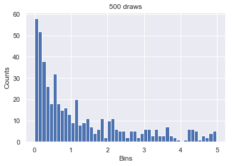
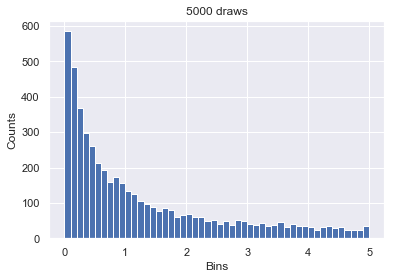
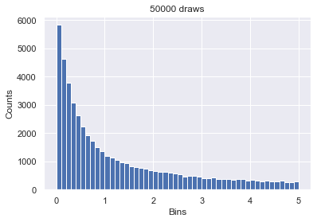

```{r setup, include=FALSE}
knitr::opts_chunk$set(echo = FALSE)
```

\newpage
# Metropolis-Hastings

In this part of the report, we will use the Metro-polis Hastings algorithm to draw samples from a Beta distribution $\phi$, with parameters $(6,4)$. Of course, this is usually not necessary as most languages are already able to draw from a Beta distribution, but this way we are able to compare our results easily with the actual distribution. However, before we start, we will describe the algorithm itself.

## Algorihm Description

The Metropolis-Hastings algorithm is a widely used statistical algorithm to generate samples from a distribution with a given probability density function (pdf). The algorithm uses a proposal distribution, that we are able to draw from, to obtain candidates for the actual sample draws. These candidates are then either accepted or rejected, according to a certain acceptance ratio. This ratio is calculated as follows:

$$ r = \frac{p(\phi_{prop}|y)/J_{+}(\phi_{prop}|\phi_{old})}{p(\phi_{old}|y)/J_{+}(\phi_{old}|\phi_{prop})}$$

The value of $r$ can actually be bigger than $1$, but that just means the candidate will definitely be accepted. Here, $p(x|y)$ is the pdf of the distribution that we want to draw from, with the parameters $y$ (possibly a vector). The function $J_{+}(x|y)$ is the pdf of the proposal (or jumping) distribution, given the parameters $y$. Finally, $\phi_{prop}$ is the candidate and $\phi_{old}$ is the value of $\phi$ used to find the candidate. For this algorithm we need a starting value, which we will randomly draw from a uniform distribution in between $0$ and $1$. We also need a proposal distribution, which in this case will be a Beta distribution with parameters $(c\phi_{old},c(1-\phi_{old}))$, where $c$ is a constant. The number of times a candidate is drawn is a formerly specified number of iterations. Both the constant $c$ and the number of iterations are used as an input of the function. Every accepted value of $\phi$ is stored in a chain, which is the output of the algorithm. The code for the function, including comments is shown below.


```{r, echo=TRUE}
Metropolis <- function(c,iteration){ #Setting constant c and number of iterations
  
  if(c <= 0){stop("Input c must be greater than 0")} #prevents nonsensical user inputs
  
  if(iteration <= 0){stop("Input iterations must be greater than 0")} 
      #prevents nonsensical user inputs
  
  fi=runif(1,0,1) #starting value for "Phi"
    
  chain = rep(0,iterations + 1) #initialzing array
  
  chain[1] = fi #putting initial value into chain
  
  for (i in 1:iteration){ #for loop for each iteration of the chain
    
    proposal = rbeta(1,c*chain[i],c*(1-chain[i])) #selects a random draw from the beta
          #distribution using parameter from chain as the proposal value
    
    
    acceptance_ratio = (dbeta(proposal,6,4)/dbeta(proposal,c*chain[i],c*(1-chain[i])))/
      (dbeta(chain[i],6,4)/dbeta(chain[i],c*proposal,c*(1-proposal)))
       #the probability of acceptance, acceptance ratio has been corrected for 
       #asymmetry of jumping function
    if (runif(1) < acceptance_ratio){
       #this combined if/else statment accepts the proposal if the acceptance ratio
       #is greater than a random draw from the uniform function.
      chain[i+1] = proposal}
    
    else{
      
      chain[i+1] = chain[i]
      
      }
  }
  return(chain) #done
}
```

## Results
### c = 1

Now that the algorithm itself has been discussed, we will run the function with $c = 1$ and $10,000$ total iterations. We will not discard any initial samples, which is sometimes done to prevent bias introduced by the starting value. The following plots show the results.

```{r}
c <- 1
iterations <- 10000

draws <- Metropolis(c,iterations)

par(mfrow = c(1,3))
plot(draws)
acf(draws)
hist(draws, freq = FALSE, main = "")
lines(seq(0,1,0.01),dbeta(seq(0,1,0.01),6,4))
```


The trace of the data is roughly what we expect, namely that the data is clustering around some central value. This is qualitatively what we expect; in essence this plot only tells us that there is nothing obviously wrong with the data. The auto correlation test shows us what we would expect; namely that initial values are highly correlated but rapidly drop off. This emphasizes the importance of the burn in since we didn't experience low auto correlation until we were about a quarter of the way through the iterations. The histogram seems to match well with the intended beta function. There are some issues near the top but this may be simply due to the limitations of trying to map a continuous function onto a discrete one.

```{r, KStest1}

c <- 1
iterations <- 10000

draws <- Metropolis(c,iterations)
print(ks.test(draws,"pbeta",6,4))

draws <- Metropolis(c,iterations)
print(ks.test(draws,"pbeta",6,4))

draws <- Metropolis(c,iterations)
print(ks.test(draws,"pbeta",6,4))

draws <- Metropolis(c,iterations)
print(ks.test(draws,"pbeta",6,4))

drawsfinal <- Metropolis(c,iterations)
print(ks.test(draws,"pbeta",6,4))

trials1 <- rbeta(1000, 0.1, 0.9)
hist(trials1, freq= FALSE, main = "Example")
lines(seq(0,1,0.01),dbeta(seq(0,1,0.01),0.1,0.9))
```

Because of the random nature of this test, we run the K-S test mulitple times, with different draws from the algorithm. What we see is that for c = 1, the K-S statistics return p values so incredibly low we must reject the null hypothesis. This is because at a low value of c, our proposal function will return essentially a pareto distribution. Therefore, when we do get a sample near the center (with relatively low probability mind you) it is likely to get stored in the chain multiple times since the following draws for the proposal are very likely to come from the heavy tail, which are themselves likely to be rejected. This effect can be seen in the above Example histogram.

The trace plot may appear difficult to understand at first, but if we examine it in comparison to subsequent plots we can infer some things. If we have a high rate of acceptance from the proposal function, (such as in c = 10), then we would expect to see an almost uniform black band across the graph. This would indicate that we rarely had to have a point duplicated in the chain due to rejection. Here we see that we had medium rate of rejection, where the darker clusters indicate a sequence of duplicates. 

The autocorrelation plot converges to 0 relatively quickly, but it is difficult to make more subtle estimations.

The histogram looks about comparable to the beta function plot, although we do tend to see a slightly higher peak, as discussed above. Again, unless the histogram is very bad, it is difficult to make inferences.

### c = 2.5

```{r, KStest2.5}

c <- 2.5
iterations <- 10000

par(mfrow = c(1,3))
plot(drawsfinal)
acf(drawsfinal)
hist(drawsfinal, freq = FALSE, main = "")
lines(seq(0,1,0.01),dbeta(seq(0,1,0.01),6,4))

draws <- Metropolis(c,iterations)
print(ks.test(draws,"pbeta",6,4))

draws <- Metropolis(c,iterations)
print(ks.test(draws,"pbeta",6,4))

draws <- Metropolis(c,iterations)
print(ks.test(draws,"pbeta",6,4))

draws <- Metropolis(c,iterations)
print(ks.test(draws,"pbeta",6,4))

drawsfinal <- Metropolis(c,iterations)
print(ks.test(draws,"pbeta",6,4))

```


For c = 2.5, we no longer see p-values nearly as low as those we saw for c = 1. This is because the variance of our proposal function is now approximating that of the one we are sampling from. This means we are getting fewer extreme values which need to be tossed out, which in turn means fewer repeated values near the center.

For the trace plot, we see a higher rate of coverage and fewer areas of pure black spots (representing a sequence of the exact same value). This is to be expected since we should have a lower rate of rejection with c = 2.5. 

Again, we have difficulty inferring anything from the autocorrelation plot beyond that it seems similar to c = 1. 

The histogram doesn't seem to have quite the same peak that the c = 1 histogram had.

### c = 10

```{r, KStest10}

c <- 10
iterations <- 10000

par(mfrow = c(1,3))
plot(drawsfinal)
acf(drawsfinal)
hist(drawsfinal, freq = FALSE, main = "")
lines(seq(0,1,0.01),dbeta(seq(0,1,0.01),6,4))

draws <- Metropolis(c,iterations)
print(ks.test(draws,"pbeta",6,4))

draws <- Metropolis(c,iterations)
print(ks.test(draws,"pbeta",6,4))

draws <- Metropolis(c,iterations)
print(ks.test(draws,"pbeta",6,4))

draws <- Metropolis(c,iterations)
print(ks.test(draws,"pbeta",6,4))

drawsfinal <- Metropolis(c,iterations)
print(ks.test(draws,"pbeta",6,4))


```

Now, with c = 10, we see another step closer to convergence of the variation. We still have some rejections, but even the smallest p-values aren't quite as small and we have a greater probability of getting p-values > 0.05. It should be noted however, that if we were to continue to much greater c's, such as c=100, we will have such a narrow variance that we aren't fully exploring the space. This means that we will have a very tightly clustered distribution, which will also return extremely small p-values.

The trace plot of c = 10, is the best we've seen so far. Namely, that we've seen good coverage of the area with an almost uniform black bar. We can also infer from this that there is relatively limited chains of the exact same value in the data, although the areas has become to dark to easily examine this. However, if we go significantly higher values of c, we would see a very narrow band of black, representing the limited variance and limited exploration of the sample space. This would also be unideal.

The autocorrelation plots look similar to those for c = 1 and c = 2.5.

### c = 0.1

```{r, KStest0.1}

c <- 0.1
iterations <- 10000

par(mfrow = c(1,3))
plot(drawsfinal)
acf(drawsfinal)
hist(drawsfinal, freq = FALSE, main = "")
lines(seq(0,1,0.01),dbeta(seq(0,1,0.01),6,4))

draws <- Metropolis(c,iterations)
print(ks.test(draws,"pbeta",6,4))

draws <- Metropolis(c,iterations)
print(ks.test(draws,"pbeta",6,4))

draws <- Metropolis(c,iterations)
print(ks.test(draws,"pbeta",6,4))

draws <- Metropolis(c,iterations)
print(ks.test(draws,"pbeta",6,4))

drawsfinal <- Metropolis(c,iterations)
print(ks.test(draws,"pbeta",6,4))

```

With c = 0.1, we have a distribution so heavily skewed that the distribution is practically all tails. This leads to an incredibly high rejection rate, which is why we no longer see any difference between the p-values; we have maxed out how small the p-values can be in R.

In the trace plot we see a large amount of white space and a handful of dark spots. The white space indicates that we had a large number of rejections, which is reflected by the black points which indicate a sequence of values which were the exact same. This is expected, as was argued in the previous paragraph.

The autocorrelation plot never goes to 0 within the number of iterations. This is also not surprising since the loss of correlation is based on the iterative change in the values of phi. If phi only rarely changes, then it is more difficult to lose the correlation.

The histogram is clearly worse off than what we have seen for the previous c's, but still holds the general shape of the beta function. This suggests that there is a great discrepancy between estimating the Gibb's sampler using the K-S test and simply comparing the histogram to the distribution.

Given what we have seen from the impact of the c variable, c = 10. Essentially, the more appropriate the c value the fewer values will be needed to replicate the proposal distribution. The comparison to the target distribution is a more difficult problem, all the histograms we have seen before are relatively well centered on the beta distribution, meaning that if we were to extract estimates of the beta and alpha terms from this data we would have similar values with similar estimates of the variance. However, what we can tell from the trace plots and the histograms is that poor choices of c will lead to overweighting certain values. This would lead to a higher degree of bias in the estimate of the parameters.

\newpage

# Gibbs Sampling

For this part of the report we use Gibbs Sampling as a means to estimate the marginal distribution generated from conditional distributions. These distributions are given by
$$p(x|y) \propto ye^{-yx}, \text{ } 0<x<B<\infty$$
$$p(y|x) \propto xe^{-yx}, \text{ } 0<y<B<\infty$$

where $B$ is a known positive constant. To use Gibbs Sampling, we first need to be able to draw from these conditional distributions. We can use Inverse Transfrom Sampling to generate these samples, however we first need to know the inverse of the cdf. Therefore we will start by computing this function. 

## Inverse Transform Sampling

Since the densities are symmetric, we can compute just the inverse of the cdf of $X$ given $Y$, and then deduce from that the inverse of the cdf of $Y$ given $X$. We can write the pdf as follows
$$ p(x|y) = cye^{-yx}, \text{ } 0<x<B<\infty$$
for some constant $c$, so that the density function integrates to $1$. The cdf is then given by
\begin{align*}
  F_{X|Y}(x|y) = \int_0^x p(s|y) \text{ d}s = \int_0^x cye^{-ys} \text{ d}s = c[-e^{-ys}]_{s=0}^x = c(1 - e^{-xy})
\end{align*}

Since we want this to integrate to $1$, we now know that $c = \frac{1}{1-e^{-By}}$, as $0 < x < B$, so that we now have our conditional cdf of $X$ given $Y$. We can then find the inverse of the cdf, $F^{-1}_{X|Y}(x|y)$, by solving the following equation.

$$ x = \frac{1}{1-e^{-By}}(1 - e^{-F^{-1}_{X|Y}(x|y)\cdot y}) \implies F^{-1}_{X|Y}(x|y) = -\frac{1}{y} \log\left(1-x(1-e^{-By})\right) $$

So now that we have found the inverse of the cdf, we can generate a random draw from this conditional distribution by generating a random draw from the uniform distribution $U$ from $0$ to $1$, and then compute $F^{-1}_{X|Y}(U|y)$. Similarly, we can draw a random sample from the conditional distribution for $Y$ given $X$, by drawing a different $U$ uniformly, and then computing $F^{-1}_{Y|X}(U|x) = F^{-1}_{X|Y}(U|x)$.

## Algorithm Description

Now that we can sample from the given conditional distributions, we will explain how to use Gibbs sampling to estimate the marginal distributions. This algorithm takes as inputs the number of iterations, the number to thin by (explained later) and the value of $B$. As for the algorithm itself, first $2$ starting values for $x$ and $y$ will be randomly drawn. Then we will iteratively draw values from the conditional distributions, and only store the values of $x$ and $y$ every so often. How often we do this is decided by the set number to thin by. We repeat this a number of iterations, and finally output the stored values of $x$ and $y$. We can look at just the $x$ values, from which we can find our estimate for the marginal density of $x$, and vice versa for $y$. The code for the algorithm is given below.

```{r, echo=TRUE, eval=FALSE}
import math
import random
import numpy
import matplotlib as plt
import seaborn as sns
import statistics

sns.set(color_codes = True)

def gibbs(N = 50000, thin = 1000, B = 5):
    mat = numpy.empty((N  +1,3,)) #create an empty numpy matrix
    B=5 #assigning upper bound
    x = numpy.random.uniform(0,B) #pick x randomly from 0 to 5
    y = numpy.random.uniform(0,B) #pick y randomly from 0 to 5
    mat[0,0] = 0 #setting an iteration number equal to 0 for starting values
    mat[0,1] = x #storing starting value x in matrix
    mat[0,2] = y #storing starting value y in  matrix
    
    for i in range(1,N + 1): 
       
        u1 = random.uniform(0,1) #draw an u value that will be used in inverse sampling
        newx = -(1/y)*math.log(1-u1*(1 - math.exp(-B*y))) 
            #inverse CDF of x that was calculated manually before
        
        x = newx #assign calculated newx as x
        
        u2  = random.uniform(0,1) #draw an u value that will be used in inverse sampling
        newy = -(1/x)*math.log(1-u2*(1 - math.exp(-B*x))) 
            #inverse CDF of y that was calculated manually before
        
        y = newy #assign calculated newy as y
        
        mat[i,0] = i #number row
        mat[i,1] = newx #store newx in a matrix in row i
        mat[i,2] = newy #store newy in a matrix in row i
 
    mat = numpy.matrix(mat)
    return(mat) #return numpy matrix, where first column is iteration number,
                #second is x and third in y
```

## Results

For the following results, we use that $B=5$, and create histograms of values for $x$, for a various amount of iterations $T$.

{width=200px}{width=200px}{width=200px}

To create these plots, the following code was used.

```{r, eval=FALSE, echo=TRUE}
trials = gibbs(500) #Example for 500 iterations. 
  #Other plots are created using 5000 and 50000 iterations
plt.pyplot.hist(trials[:,1],bins = 50) #Create histogram
plt.pyplot.title('500 draws') #Add title
plt.pyplot.xlabel('Bins') #Add label on x-axis
plt.pyplot.ylabel('Counts') #Add label on y-axis
```

As we can see from the three plots shown above, the density of $x$ seems to have a similar shape for all amounts of iterations, where more iterations result in a smoother empirical density. Remember that the values of $x$ will always be in between $0$ and $B=5$, so these histograms show all values of $x$. Now aside from an estimation of the marginal densities found by the histograms, we can also use Gibbs sampling to find estimates for the moments of these marginal densities. For example, we know that the sample average is an unbiased and consistent estimator for the first moment of $X$, $\mathbb{E}_{p(X)}[X]$. We can simply take the mean of all $x$-values that are given in the output to find this sample average. The following code was used.

```{r, eval=FALSE, echo=TRUE}
statistics.mean(numpy.asarray(trials)[:,1]) 
  #The same trials were used for creating the histograms,
  #so the following averages correspond with these histograms.
  #Again, this is only the example for 500 iterations.
```

The estimates for the first moments are then given below.
\begin{itemize}
  \item $500$ iterations: $\mathbb{E}_{p(X)}[X] \approx 1.2841215406495794$
  \item $5000$ iterations: $\mathbb{E}_{p(X)}[X] \approx 1.2586229563432523$
  \item $50000$ iterations: $\mathbb{E}_{p(X)}[X] \approx 1.2697125546442287$
\end{itemize}

As we know that the estimates get better for a higher amount of iterations, we are inclined to believe that the estimate for $50000$ iterations is the closest to the true value of $\mathbb{E}_{p(X)}[X]$.

\newpage

#K-means classifier

In the code below we cluster data from the wine dataset, using a k-means method.
Our function returns a list with 2 objects: the means of the clusters and the results of our clustering. We receive clusters with a total of 47, 62 and 69 observations. Note that the k-means function built in R produces the same result, meaning that our code is working.

```{r, message=FALSE, echo=TRUE}
library(rattle) #import data
library(fpc) #import plot
data(wine)

mywine <- as.matrix(wine[,-1]) # remove the existing clustering

cluster <- function(data){ #declare function
  nrows <- length(data[,1]) #create variable with number of rows of data
  ncols <- length(data[1,]) #create variable with number of columns of data
  iterations <- 20
  set.seed(1) 
  means <- data[sample(1:nrows,3),] #select rows from the original data set to serve
    #as the initial means/centers
  for(i in 1:iterations){ #for loop for each of the iterations of reassigning the means
    distances <- matrix(rep(0,3*nrows),nrow = nrows) #distances matrix initialized
    mindistances <- matrix(rep(0, 2*nrows), nrow = nrows) #mindistances matrix initialized
    for(j in 1:nrows){ #for each row
      for(k in 1:3){ #for each cluster
        distances[j,k] <- sum((data[j,]-means[k,])^2) 
        #finds the difference between the row j and the mean ascribed to cluster K
      }
      mindistances[j,] <- c(min(distances[j,]), which.min(distances[j,])) 
      #finds the minimum distance for each row amongst the three clusters and assigns
      #it to mindistances in the first column and the second column has the cluster
    }
    for(l in 1:3){ #for each cluster
      datarows <- data[mindistances[,2]==l,] #selects the data corresponding to
        #each of the clusters
      means[l,] <- colMeans(data[mindistances[,2]==l,])
      #the above line takes the mean of each column and 
      #stores them as the new means vector
    }
  }
  return(list(means, mindistances)) #returns means and mindistances
}
results <- cluster(mywine) 
results[[1]][,]
sum(results[[2]][,2] == 1)
sum(results[[2]][,2] == 2)
sum(results[[2]][,2] == 3)
```

```{r, echo=TRUE}
kmeans(wine[,-1],3,algorith="Lloyd")  #running R k-means classifier as comparison
```


Then we visualize our clusters to check how well are they separated. And as we see from the plot, observations are grouped adequate, however there is no distinct border between clusters.

```{r, echo=TRUE}
plotcluster(mywine, results[[2]][,2]) #plots clusters
```


Later, we have to quantify the results of k-mean clustering. In order to do that we run following code:

```{r, message=FALSE, echo=TRUE}
require(data.table)
wine_cluster <- cbind(wine,results[[2]][,2]) #add variable with  cluster to wine dataset
colnames(wine_cluster)[15] <- "clusters" #name new variable
type_1 <-setkey(data.table((wine_cluster[wine_cluster$Type == 1,2:14]))) 
  #subgroup observation with type 1 
type_2 <-setkey(data.table((wine_cluster[wine_cluster$Type == 2,2:14]))) 
  #subgroup observation with type 2 
type_3 <-setkey(data.table((wine_cluster[wine_cluster$Type == 3,2:14]))) 
  #subgroup observation with type 3 
cluster_1 <-setkey(data.table((wine_cluster[wine_cluster$clusters == 1,2:14]))) 
  #subgroup observation that are classified as claster 1 
cluster_2 <-setkey(data.table((wine_cluster[wine_cluster$clusters == 2,2:14]))) 
  #subgroup observation that are classified as claster 2
cluster_3 <-setkey(data.table((wine_cluster[wine_cluster$clusters == 3,2:14]))) 
  #subgroup observation that are classified as claster 3
cluster1_type1<-na.omit(cluster_1[type_1,which=TRUE]) 
  #rows that in cluster 1 and originally typed as 1
cluster1_type2<-na.omit(cluster_1[type_2,which=TRUE]) 
  #rows that in cluster 1 and originally typed as 2
cluster1_type3<-na.omit(cluster_1[type_3,which=TRUE]) 
  #rows that in cluster 1 and originally typed as 3
cluster2_type1<-na.omit(cluster_2[type_1,which=TRUE]) 
  #rows that in cluster 2 and originally typed as 1
cluster2_type2<-na.omit(cluster_2[type_2,which=TRUE]) 
  #rows that in cluster 2 and originally typed as 2
cluster2_type3<-na.omit(cluster_2[type_3,which=TRUE]) 
  #rows that in cluster 2 and originally typed as 3
cluster3_type1<-na.omit(cluster_3[type_1,which=TRUE]) 
  #rows that in cluster 3 and originally typed as 1
cluster3_type2<-na.omit(cluster_3[type_2,which=TRUE]) 
  #rows that in cluster 3 and originally typed as 2
cluster3_type3<-na.omit(cluster_3[type_3,which=TRUE]) 
  #rows that in cluster 3 and originally typed as 3

method<-c(length(cluster1_type1),length(cluster1_type2),length(cluster1_type3)
          ,length(cluster2_type1),length(cluster2_type2),length(cluster2_type3)
          ,length(cluster3_type1),length(cluster3_type2),length(cluster3_type3))
  #count rows in groups cluster-type
matrix<-matrix(method,nrow = 3,ncol = 3, byrow=TRUE) #create matrix 3 by 3 
colnames(matrix) <- c("Type 1","Type 2","Type 3") #set column names
rownames(matrix) <- c("Cluster 1","Cluster 2","Cluster 3") #set row names
matrix
```

The output of following code is a 3 by 3 matrix that can be interpreted as follows: The intersection of row Cluster 1 and column Type 1 is the amount of observation in cluster 1 which are also type 1 in the original wine file. The sum of each row must be equal to the size of the clusters (47,62,69) and it is exactly what we observe.

As we see, cluster 1 mostly consist of type 1 wine, with only one type 2 wine. Cluster 2 can be interpreted as mostly type 2 wines, with 19 misgrouped type 3 wines. Cluster 3 is not that easy to interpret as it includes all types of wine. However, we can say that it is type 3 wine cluster.


##K-means for scaled data

Using the same code, we use scaled data this time. We will not define our function again and use code above. The function returns clusters with 51, 61 and 66 observations. As we see from the plot, scaling the data improves clustering a lot. After scaling observation can be distinctly grouped with clear borders between clusters. 

```{r, echo=TRUE}
data(wine) #scale data
set.seed(0)
mywine_scaled <- as.matrix(scale(wine[,-1])) # remove the existing clustering

results <- cluster(mywine_scaled)

results[[1]][,]
sum(results[[2]][,2] == 1)
sum(results[[2]][,2] == 2)
sum(results[[2]][,2] == 3)

plotcluster(mywine, results[[2]][,2]) #plots clusters
```

Our method for checking quality of the clustering also shows improvement over unscaled data.  For example, cluster 2 fully consist of type 2 wine. Cluster 1 became assosiated with type 3 wine with only 3 observations of type 2. Cluster 2 attributes type 1 wine with only 2 wrongly clustered obseration. 
Thus, after scaling the data, the k-means cluster algorithm wrongly classifies only 5 rows which is 3% of the total dataset.
 
```{r, echo=FALSE}
wine_cluster_scaled <- cbind(wine,results[[2]][,2])
colnames(wine_cluster_scaled)[15] <- "clusters"
type_1 <-setkey(data.table((wine_cluster_scaled[wine_cluster_scaled$Type == 1,2:14])))
type_2 <-setkey(data.table((wine_cluster_scaled[wine_cluster_scaled$Type == 2,2:14])))
type_3 <-setkey(data.table((wine_cluster_scaled[wine_cluster_scaled$Type == 3,2:14])))
cluster_1 <-setkey(data.table((wine_cluster_scaled[wine_cluster_scaled$clusters == 1,2:14])))
cluster_2 <-setkey(data.table((wine_cluster_scaled[wine_cluster_scaled$clusters == 2,2:14])))
cluster_3 <-setkey(data.table((wine_cluster_scaled[wine_cluster_scaled$clusters == 3,2:14])))
cluster1_type1<-na.omit(cluster_1[type_1,which=TRUE])
cluster1_type2<-na.omit(cluster_1[type_2,which=TRUE])
cluster1_type3<-na.omit(cluster_1[type_3,which=TRUE])
cluster2_type1<-na.omit(cluster_2[type_1,which=TRUE])
cluster2_type2<-na.omit(cluster_2[type_2,which=TRUE])
cluster2_type3<-na.omit(cluster_2[type_3,which=TRUE])
cluster3_type1<-na.omit(cluster_3[type_1,which=TRUE])
cluster3_type2<-na.omit(cluster_3[type_2,which=TRUE])
cluster3_type3<-na.omit(cluster_3[type_3,which=TRUE])

method<-c(length(cluster1_type1),length(cluster1_type2),length(cluster1_type3),length(cluster2_type1),length(cluster2_type2),length(cluster2_type3),length(cluster3_type1),length(cluster3_type2),length(cluster3_type3))
matrix<-matrix(method,nrow = 3,ncol = 3, byrow=TRUE)
colnames(matrix) <- c("Type 1","Type 2","Type 3")
rownames(matrix) <- c("Cluster 1","Cluster 2","Cluster 3")
matrix

```


##K-mean for iris dataset
In the following section we will run our previously defined function on the iris dataset and only new code will be commented, since we are running the same procedure.

Our function clusters the dataset into groups of 39, 50 and 61 observations. From the plot we can observe that cluster 1 is separated from other data, but clusters 2 and 3 are hard to distinguish. 

```{r, echo=TRUE}
data(iris)
iris <- as.matrix(iris[,1:4]) # remove column with species
set.seed(421)

results <- cluster(iris) 

results[[1]][,]
sum(results[[2]][,2] == 1)
sum(results[[2]][,2] == 2)
sum(results[[2]][,2] == 3)
plotcluster(iris, results[[2]][,2]) 

```

We can also notice that from this dataset, the k-means method clusters species 1 properly, but has more mistakes in grouping species 2 and 3 because 19 out of 150 observations were misgrouped (12,6% from total dataset).


```{r, echo=TRUE}
data(iris)

#Chaning properties of the data set so that our comparison method can be applied
iris <- as.matrix(iris) 
iris[iris=="setosa"] <- 1 #recode variable species 
iris[iris=="versicolor"] <- 2 #recode variable species
iris[iris=="virginica"] <- 3 #recode variable species
iris_clusters <- cbind(results[[2]][,2],iris) #add first column with cluster
colnames(iris_clusters)[1] <- "clusters"

iris_clusters<-as.data.frame(iris_clusters)
```

```{r, echo=FALSE}
require(data.table)
species_1 <-setkey(data.table((iris_clusters[iris_clusters$Species == 1,2:5])))
species_2 <-setkey(data.table((iris_clusters[iris_clusters$Species == 2,2:5])))
species_3 <-setkey(data.table((iris_clusters[iris_clusters$Species == 3,2:5])))
cluster_1 <-setkey(data.table((iris_clusters[iris_clusters$clusters == 1,2:5])))
cluster_2 <-setkey(data.table((iris_clusters[iris_clusters$clusters == 2,2:5])))
cluster_3 <-setkey(data.table((iris_clusters[iris_clusters$clusters == 3,2:5])))
cluster1_species_1<-na.omit(cluster_1[species_1,which=TRUE])
cluster1_species_2<-na.omit(cluster_1[species_2,which=TRUE])
cluster1_species_3<-na.omit(cluster_1[species_3,which=TRUE])
cluster2_species_1<-na.omit(cluster_2[species_1,which=TRUE])
cluster2_species_2<-na.omit(cluster_2[species_2,which=TRUE])
cluster2_species_3<-na.omit(cluster_2[species_3,which=TRUE])
cluster3_species_1<-na.omit(cluster_3[species_1,which=TRUE])
cluster3_species_2<-na.omit(cluster_3[species_2,which=TRUE])
cluster3_species_3<-na.omit(cluster_3[species_3,which=TRUE])

method<-c(length(cluster1_species_1),length(cluster1_species_2),length(cluster1_species_3),length(cluster2_species_1),length(cluster2_species_2),length(cluster2_species_3),length(cluster3_species_1),length(cluster3_species_2),length(cluster3_species_3))
matrix<-matrix(method,nrow = 3,ncol = 3, byrow=TRUE)
colnames(matrix) <- c("Species 1","Species 2","Species 3")
rownames(matrix) <- c("Cluster 1","Cluster 2","Cluster 3")
matrix

```


##K-means for iris scaled data

In the code below we first scale iris data in order to improve results of k-mean clustering.
We receive groups of 50, 56, 44 observations. From the plot we can observe that again cluster 1 is separated from the majority of the data and thus clustered properly, but clusters 2 and 3 are still hard to distinguish. 

```{r, echo=TRUE}
data(iris)
iris <- as.matrix(iris[,1:4]) # remove column with species
iris_scaled <- as.matrix(scale(iris)) #scale data
set.seed(421)

results <- cluster(iris_scaled) 

results[[1]][,]
sum(results[[2]][,2] == 1)
sum(results[[2]][,2] == 2)
sum(results[[2]][,2] == 3)
plotcluster(iris, results[[2]][,2]) 
```


Corresponding with the result of the unscaled data, cluster 1 assosiated with species 1 is matched correctly, however scaling does not improve clustering for species 2 and 3. In fact, instead of 19 misgrouped observation we receive 30 (16% from dataset). Thus, we can conclude that scaling data does not always improve results of clustering and in some cases can negatively affect it.

```{r, echo=FALSE}
data(iris)
iris <- as.matrix(iris)
iris_scaled <- cbind(iris_scaled,iris[,5]) #add species column 
iris_scaled[iris_scaled=="setosa"] <- 1 #recode variable species 
iris_scaled[iris_scaled=="versicolor"] <- 2 #recode variable species
iris_scaled[iris_scaled=="virginica"] <- 3 #recode variable species

iris_scaled <- cbind(results[[2]][,2],iris_scaled) #add first column with cluster
colnames(iris_scaled)[1] <- "clusters"
colnames(iris_scaled)[6] <- "Species"

iris_scaled<-as.data.frame(iris_scaled)

require(data.table)
species_1 <-setkey(data.table((iris_scaled[iris_scaled$Species == 1,2:5])))
species_2 <-setkey(data.table((iris_scaled[iris_scaled$Species == 2,2:5])))
species_3 <-setkey(data.table((iris_scaled[iris_scaled$Species == 3,2:5])))
cluster_1 <-setkey(data.table((iris_scaled[iris_scaled$clusters == 1,2:5])))
cluster_2 <-setkey(data.table((iris_scaled[iris_scaled$clusters == 2,2:5])))
cluster_3 <-setkey(data.table((iris_scaled[iris_scaled$clusters == 3,2:5])))


cluster1_species_1<-na.omit(cluster_1[species_1,which=TRUE])
cluster1_species_2<-na.omit(cluster_1[species_2,which=TRUE])
cluster1_species_3<-na.omit(cluster_1[species_3,which=TRUE])
cluster2_species_1<-na.omit(cluster_2[species_1,which=TRUE])
cluster2_species_2<-na.omit(cluster_2[species_2,which=TRUE])
cluster2_species_3<-na.omit(cluster_2[species_3,which=TRUE])
cluster3_species_1<-na.omit(cluster_3[species_1,which=TRUE])
cluster3_species_2<-na.omit(cluster_3[species_2,which=TRUE])
cluster3_species_3<-na.omit(cluster_3[species_3,which=TRUE])

method<-c(length(cluster1_species_1),length(cluster1_species_2),length(cluster1_species_3),length(cluster2_species_1),length(cluster2_species_2),length(cluster2_species_3),length(cluster3_species_1),length(cluster3_species_2),length(cluster3_species_3))
matrix<-matrix(method,nrow = 3,ncol = 3, byrow=TRUE)
colnames(matrix) <- c("Species 1","Species 2","Species 3")
rownames(matrix) <- c("Cluster 1","Cluster 2","Cluster 3")
matrix

```
